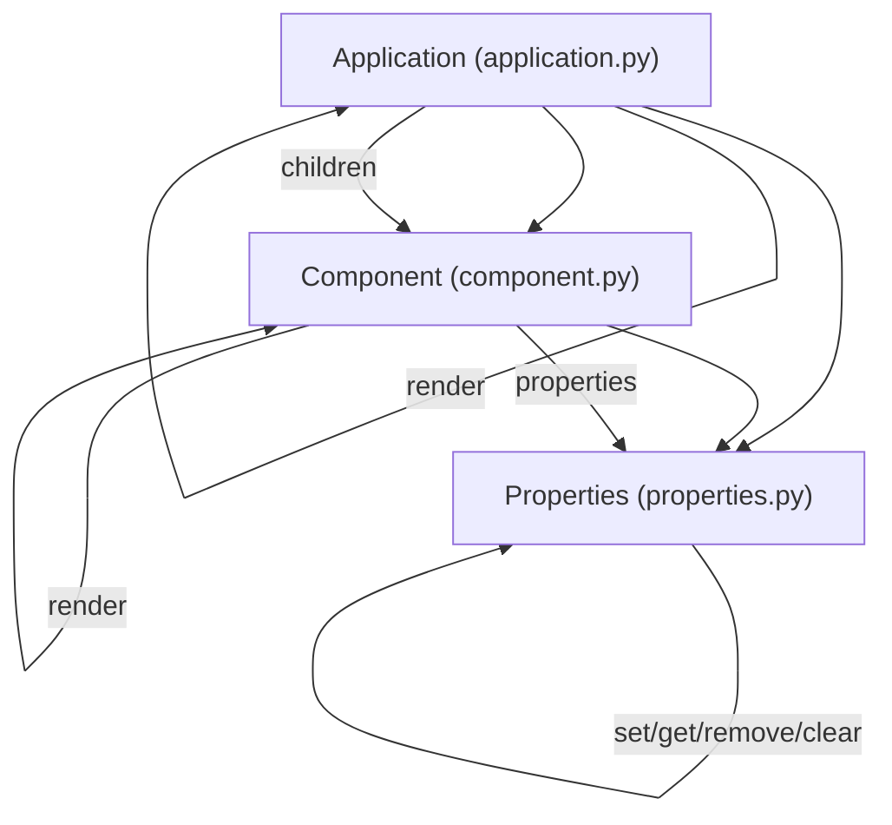

# Architecture

```mermaid
flowchart TD
    Application["Application (application.py)"]
    Component["Component (component.py)"]
    Properties["Properties (properties.py)"]

    Application --> Component
    Application --> Properties
    Component --> Properties

    Component -.->|parent| Component
    Component -.->|children| Component

    Properties -->|dictionary| Properties
    Component -->|properties| Properties

    Application -->|children| Component
    Application -->|render| Application
    Component -->|render| Component
    Properties -->|set/get/remove/clear| Properties
```
