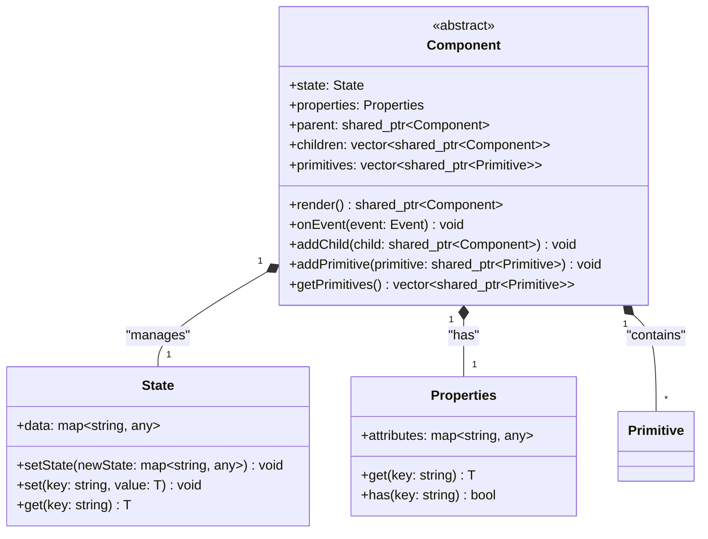
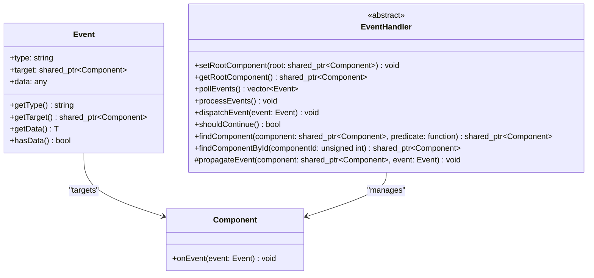
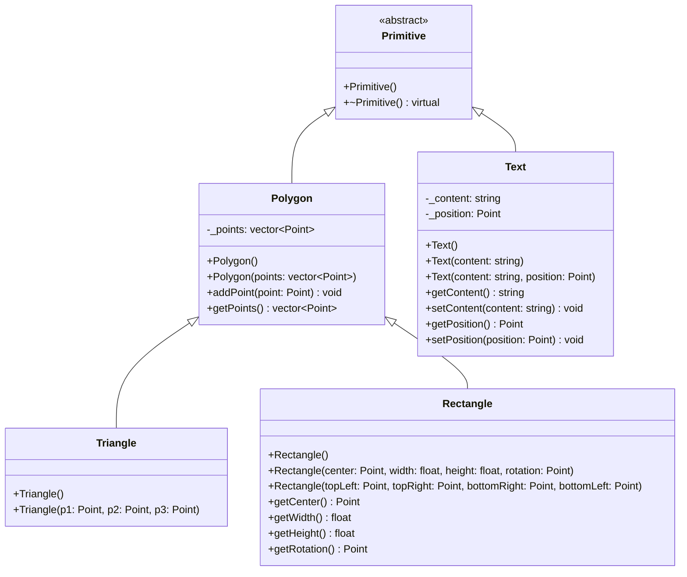
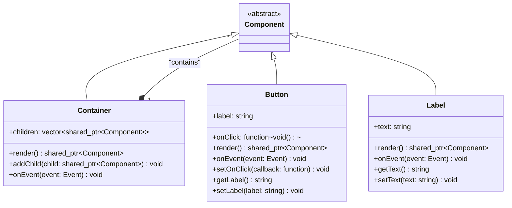
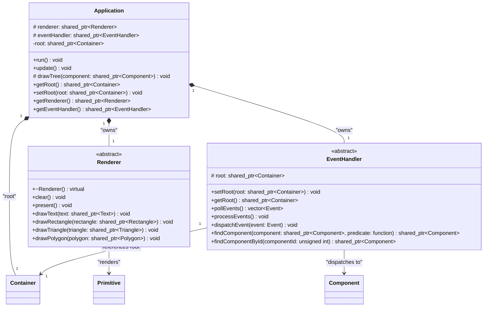
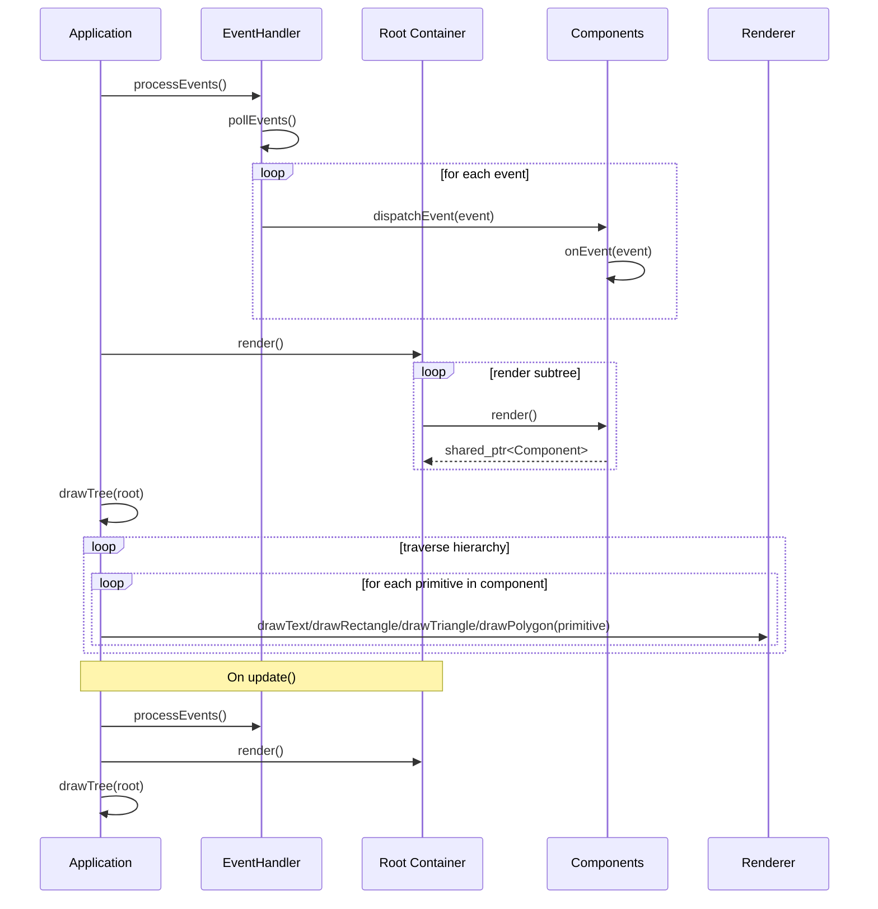

# Architecture

The architecture of our UI component library is designed to be modular, extensible, and easy to understand. Below is a detailed breakdown of the main components and their interactions.

## Core Component System

The foundation of our architecture is built around a hierarchical component system:

**Component** serves as the abstract base class for all UI elements. It manages local state and properties while defining the contract for rendering and event handling. Each component maintains references to its parent and children, enabling a tree-like structure.

**State** holds the dynamic data of a component. When `setState` is called, it triggers a re-render of the component and its children, ensuring the UI stays synchronized with the data.

**Properties** contains immutable attributes passed to the component, typically from its parent. This separation allows for clear data flow and component reusability.

## Event System

The **Event** system handles user interactions and other asynchronous operations. Events bubble up through the component hierarchy, allowing for flexible event handling patterns.

The **EventHandler** is an abstract class that provides an interface for managing events across different backends. Similar to how Renderer abstracts the rendering backend, EventHandler abstracts the event input backend:

- **pollEvents()**: Pure virtual method that must be implemented by derived classes to capture events from the backend (SDL, terminal input, web events, etc.)
- **processEvents()**: Virtual method that polls events and dispatches them, can be overridden for custom event processing logic
- **dispatchEvent()**: Dispatches events to the appropriate components in the hierarchy
- **Utility methods**: Provides helpers to find components by ID or custom predicates

## Primitive System

The library includes a primitive system for low-level geometric shapes that can be used for custom rendering:

**Primitive** serves as the abstract base class for all drawing primitives. It provides a common interface for geometric shapes that can be rendered by the Renderer.

**Polygon** is a fundamental primitive that represents a shape defined by a series of points (vertices). It stores the vertices and provides methods to manipulate them.

**Triangle** is a specialized polygon with exactly three vertices, useful for mesh-based rendering and geometric operations.

**Rectangle** is a specialized polygon that can be defined by:

- a center point, width, height, and 3D rotation (Euler angles),
- or by four corner points for full 3D control.

It automatically computes the four vertices in 3D space, supporting arbitrary orientation and depth.

**Text** is a specialized primitive that represents text content at a specific position. This allows components like Labels and Buttons to generate text primitives for rendering instead of handling text rendering directly. Text primitives contain the content string and position information.

## Concrete Components

**Container** is a specialized component for grouping other components. It manages the hierarchy and handles recursive rendering of its children. Containers typically don't generate primitives themselves but orchestrate their children.

**Button** represents an interactive element with click handling capabilities. During rendering, it generates both Rectangle primitives (for the button background) and Text primitives (for the button label), demonstrating how components can produce multiple primitives.

**Label** is a simple text display component that generates Text primitives during rendering. It typically doesn't handle user interactions but can be styled and positioned within the layout.

## Application and Rendering

**Application** serves as the entry point and manages the global lifecycle. It owns the root container component, renderer, and event handler, coordinating updates, event processing, and the rendering pipeline. The rendering pipeline is a two-phase process:

1. **Virtual render**: `Component::render()` recursively calls `render()` on children to compute/update component state and generate primitives for the current frame.
2. **Physical draw**: `Application::drawTree()` traverses the component hierarchy and calls specific `Renderer::draw*()` methods (drawText, drawRectangle, etc.) on each primitive to emit the actual output.

**Renderer** is an abstract class responsible for drawing primitives to the screen and handling events from the rendering backend. This abstraction allows the library to support different rendering backends (terminal, GUI frameworks, web canvas, etc.) without changing the component logic. The renderer only deals with primitives, never components directly.

The Renderer provides specific methods for each primitive type (`drawText`, `drawRectangle`, `drawTriangle`, `drawPolygon`). The Application's `drawTree()` method uses dynamic casting to dispatch primitives to the appropriate specific draw method, ensuring type safety while maintaining flexibility.

**EventHandler** is an abstract class responsible for capturing, processing, and dispatching events from different input sources (mouse, keyboard, touch, etc.). This abstraction allows the library to support different event backends (SDL events, terminal input, web events, etc.) without changing the component logic. The event handler maintains a reference to the root container for event dispatching and provides:

- **pollEvents()**: Captures raw events from the backend
- **processEvents()**: Processes and dispatches events to components
- **dispatchEvent()**: Sends events to the component hierarchy
- **setRoot()** / **getRoot()**: Manages the reference to the root container for event dispatching
- **Utility methods**: Finds components by ID or custom predicates

### Lifecycle and Flow

The typical lifecycle involves initial run followed by updates triggered by events or state changes. The high-level sequence is:

This split allows you to:

1. Process input events from the backend
2. Update component state based on events
3. Compute layout/state separately from concrete drawing
4. Render to the actual output backend

## Architecture Benefits

- **Modularity**: Each component is self-contained with clear responsibilities
- **Extensibility**: New components can be easily added by inheriting from the base Component class
- **Separation of Concerns**: State, properties, and rendering are handled separately
- **Primitive-Based Rendering**: Components generate primitives during render, and renderers only handle primitives. This creates a clean separation where components manage logic/state while primitives handle visual representation
- **Flexible Rendering**: The abstract Renderer allows for multiple output targets, with a clear separation between virtual render (state/structure) and physical draw (output)
- **Flexible Event Handling**: The abstract EventHandler allows for multiple input backends (SDL, terminal, web, etc.), with a clear separation between event capture and event processing
- **Type-Safe Rendering**: Specific draw methods for each primitive type provide compile-time safety and clear contracts for renderer implementations
- **Type-Safe Event Handling**: Event system with type-erased data payload allows flexible event handling while maintaining type safety
- **Event-Driven**: Reactive updates through the event and state system
- **Composable Graphics**: Components can generate multiple primitives for complex visuals (e.g., Button creates both Rectangle and Text primitives)
- **Extensible Primitive System**: Low-level primitive system enables custom rendering and advanced graphics capabilities
- **Backend Abstraction**: Clean separation between input (EventHandler), logic (Components), and output (Renderer)

## Notes on State and Updates

- Setting state via `State::set` or `setState` can be used to trigger re-renders when integrated with an application-level update strategy. In the current setup, components update their internal values during `render()`, and the application explicitly calls `update()` to re-run render and draw.
- Event handlers (e.g., `Button::onEvent` for "click") can mutate component state or other components (e.g., `Label::setText`), after which `Application::update()` should be invoked to redraw.

## Primitive Generation

Components generate primitives during their `render()` method:

- **Label**: Creates a single Text primitive with its content
- **Button**: Creates a Rectangle primitive (background) and Text primitive (label)
- **Container**: Typically creates no primitives, purely structural

The `render()` method should clear existing primitives and regenerate them based on current state, ensuring the visual representation stays synchronized with component data.
