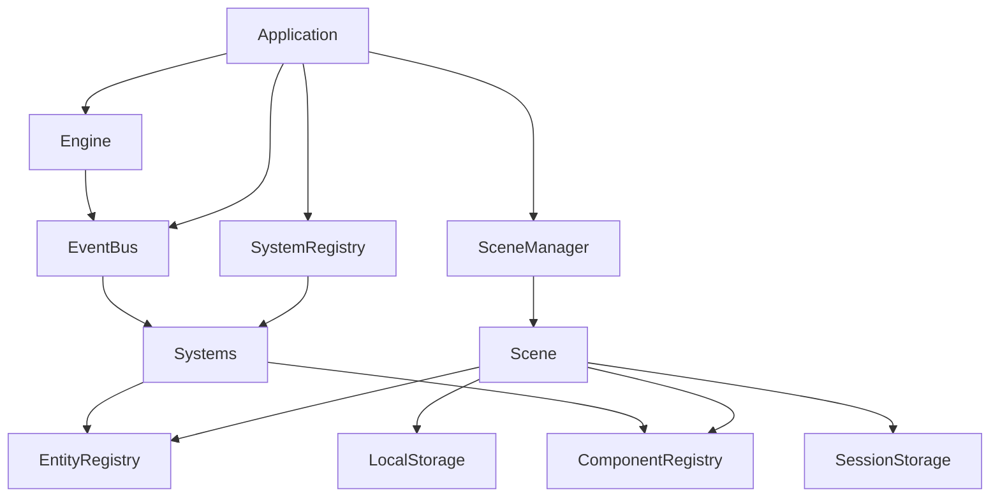
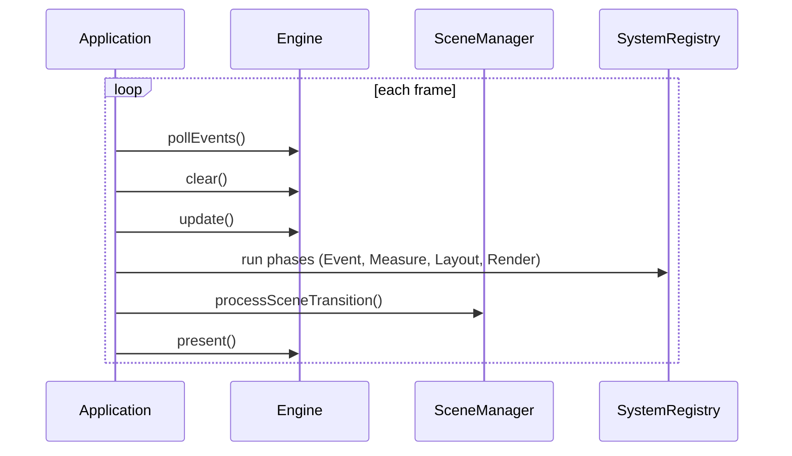
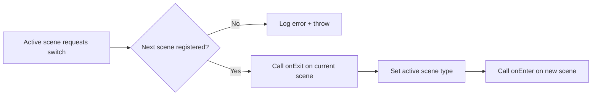

# Guillaume Architecture

Guillaume is organized around an entity-component-system model so UI state,
presentation, and interaction logic stay separate.

## Module Layout

```mermaid
graph TD
    App[Application] --> SM[SceneManager]
    App --> EB[EventBus]
    App --> SR[SystemRegistry]
    App --> Engine[Engine]

    SM --> Scene[Scene]
    Scene --> ER[EntityRegistry]
    Scene --> CR[ComponentRegistry]

    SR --> Systems[Systems]
    Systems --> ER
    Systems --> CR

    EB --> Systems
    Engine --> EB

    Scene --> LS[LocalStorage]
    Scene --> SS[SessionStorage]
```

- **Application** owns the engine, scene manager, event bus, and system
  registry, and drives the main loop.
- **SceneManager** owns the registered scenes and handles transitions.
- **Scene** owns an entity registry and a component registry.
- **Systems** read components and traverse entities each frame.
- **EventBus** routes typed events to subscribed listeners and systems.
- **Storage** (`LocalStorage`/`SessionStorage`) provides key-value persistence.

## Frame Lifecycle

```mermaid
sequenceDiagram
    participant App as Application
    participant Engine
    participant SM as SceneManager
    participant SR as SystemRegistry

    loop each frame
        App->>Engine: pollEvents()
        App->>Engine: clear()
        App->>Engine: update()
        App->>SR: run phases (Event, Measure, Layout, Render)
        App->>SM: processSceneTransition()
        App->>Engine: present()
    end
```

The main loop is single-threaded: input → update → render → present.

## Scene Transition Flow

```mermaid
flowchart LR
    A[Active scene requests switch] --> B{Next scene registered?}
    B -- No --> E[Log error + throw]
    B -- Yes --> C[Call onExit on current scene]
    C --> D[Set active scene type]
    D --> F[Call onEnter on new scene]
```

## Design Goal

Keep the UI framework composable enough for complex interfaces while keeping
the public API small and predictable.
