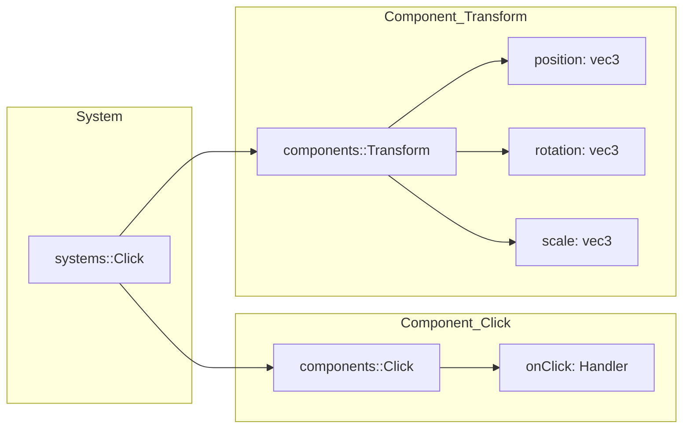
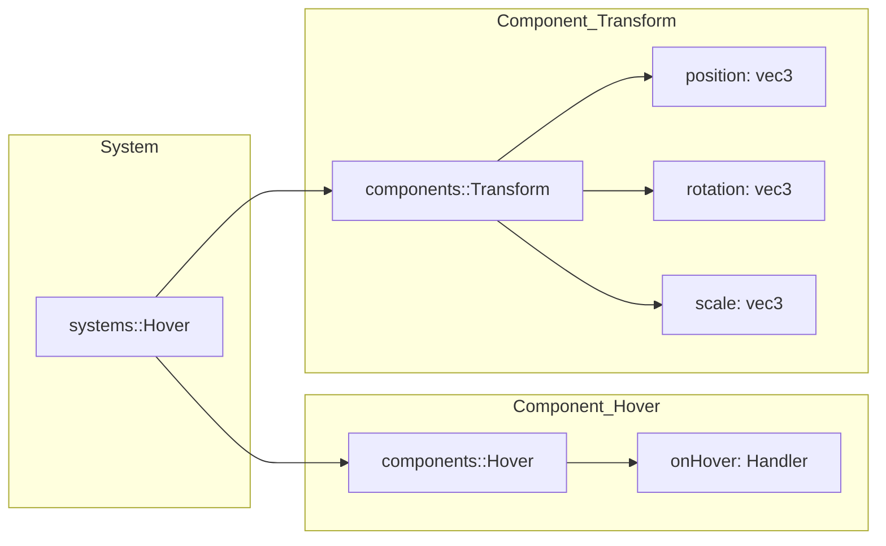
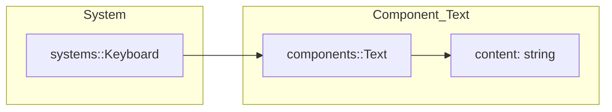
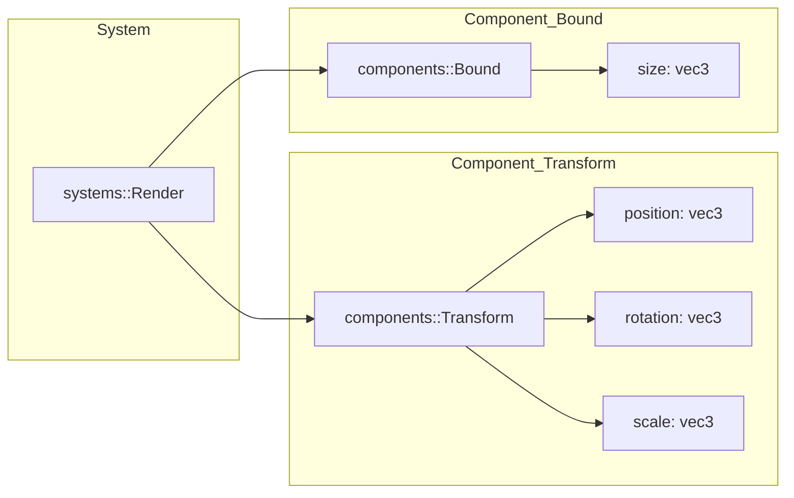
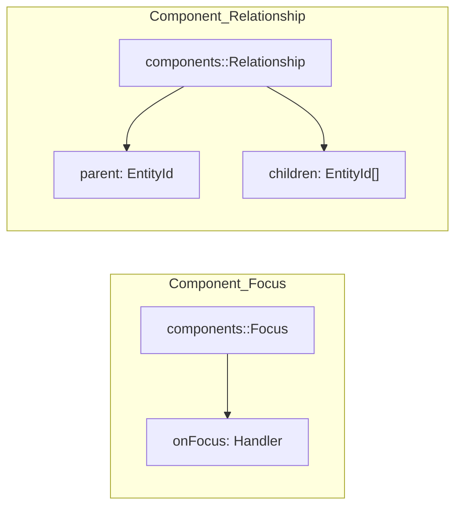

# ECS Components and Systems

This document focuses on the internal ECS wiring used by Guillaume. It is aimed at contributors who need to understand how systems are registered, how component signatures are matched, and how entity updates flow through the runtime.

## Architecture overview

The public `guillaume::ECS` class is a thin wrapper around the core ECS template and registers the default systems. Registration happens in the constructor and wires each system with its dependencies (event bus or renderer). See [headers/guillaume/ecs.hpp](headers/guillaume/ecs.hpp) and [sources/ecs.cpp](sources/ecs.cpp).

The ECS runtime relies on two registries:

- **ComponentRegistry** stores component pools and exposes type ids, signatures, and accessors for systems.
- **SystemRegistry** stores system instances and updates their entity membership when an entity signature changes.

System membership is signature-based. When an entity gains or loses components, `SystemRegistry::onEntitySignatureChanged` re-evaluates which systems should contain that entity. This keeps system iteration lean and avoids per-entity filtering inside `System::routine()`.

## System update flow

At runtime, the application calls `ECS::routine()`, which iterates every system and calls `System::routine()` to update each registered entity. That method delegates to each system's `update()` implementation for the entity. See [sources/ecs/system.cpp](sources/ecs/system.cpp) and [headers/guillaume/ecs/system.hpp](headers/guillaume/ecs/system.hpp).

Systems typically inherit from `ecs::SystemFiller<...>` to declare their required components. This determines the signature used for membership. See [headers/guillaume/ecs/system_filler.hpp](headers/guillaume/ecs/system_filler.hpp) and the system headers in [headers/guillaume/systems](headers/guillaume/systems).

## Minimal usage snippet

```cpp
#include <guillaume/application.hpp>
#include <guillaume/components/bound.hpp>
#include <guillaume/components/transform.hpp>

guillaume::Application app;
guillaume::ECS &ecs = app.getECS();

// Example: create an entity with Transform + Bound to be rendered.
guillaume::ecs::Entity entity;

ecs.addComponent<guillaume::components::Transform>(entity);
ecs.addComponent<guillaume::components::Bound>(entity);

ecs.addEntity(entity);
```

## Component notes

Components are intentionally simple data holders. Event-driven components such as `Click`, `Hover`, and `Focus` store a handler callback. Spatial components such as `Transform` and `Bound` store `vec3` values. `Relationship` maintains parent/child identifiers for scene graph-like associations.

When adding new components, prefer plain data with minimal logic. Systems should own behavior and interpretation of component data. This keeps the ECS predictable and makes unit testing easier. Use `ECS::addComponent()` instead of writing directly to the registry so entity signatures and system membership stay consistent.

## systems::Click



## systems::Hover



## systems::Keyboard



## systems::Render



## Other components


