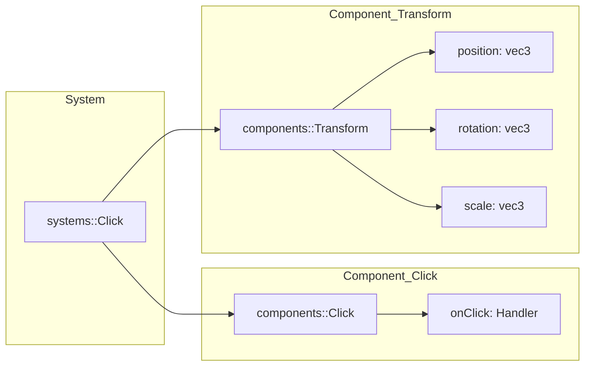
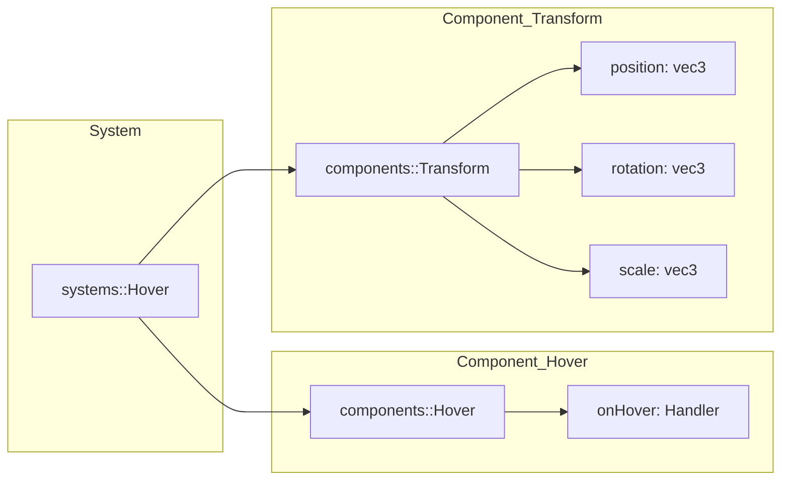
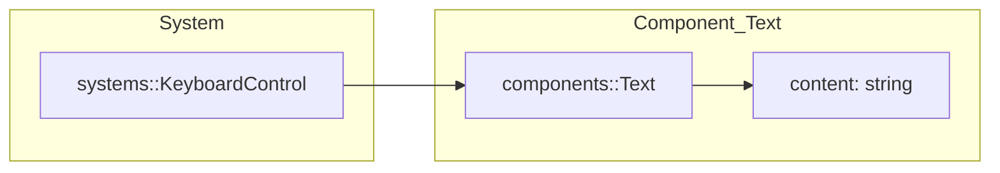
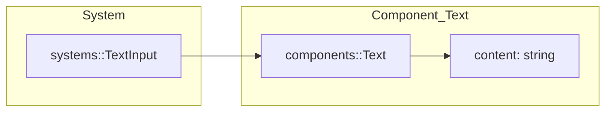
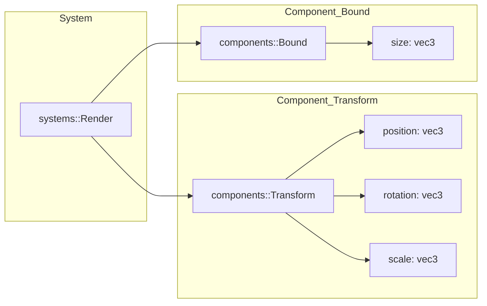
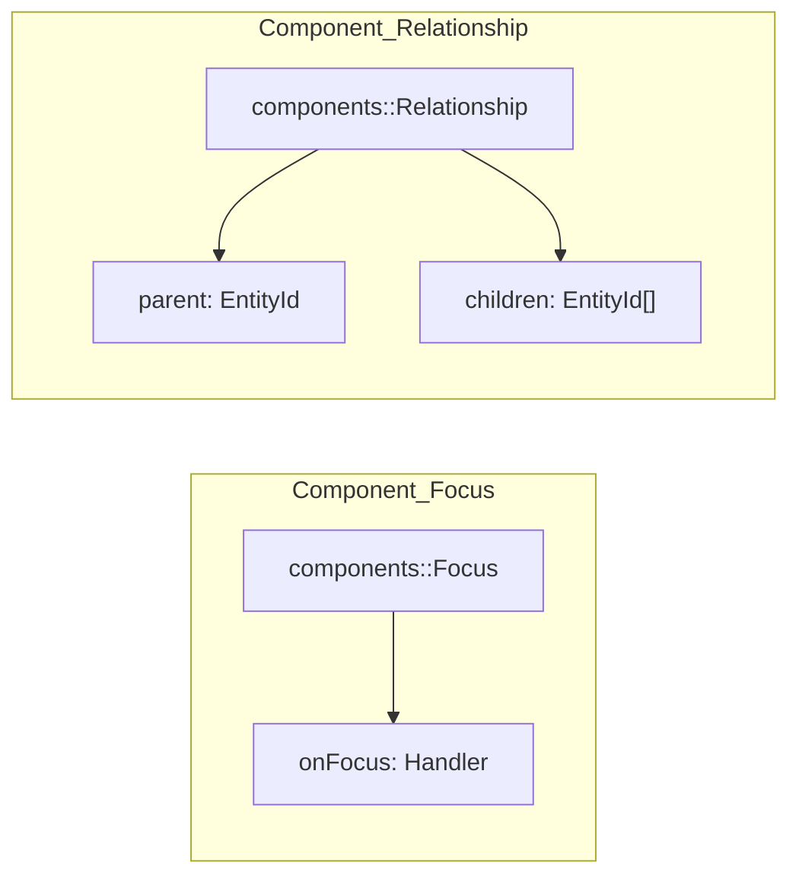

# ECS Components and Systems

This document focuses on the internal ECS wiring used by Guillaume. It is aimed at contributors who need to understand how systems are registered, how component signatures are matched, and how entity updates flow through the runtime.

## Architecture overview

The application owns a shared `ecs::SystemRegistry` and registers the default systems once. Systems are wired with their dependencies (event bus or renderer) during `Application` initialization. See [headers/guillaume/application.hpp](headers/guillaume/application.hpp).

The ECS runtime relies on two registries:

- **SystemRegistry** is global in the application ECS instance and stores shared system instances.
- **ComponentRegistry** is owned by each scene and stores component pools for that scene only.

The active scene determines which component registry is used at runtime. This allows scenes to keep isolated component data while reusing the same systems.

System membership is signature-based. When an entity gains or loses components, `SystemRegistry::onEntitySignatureChanged` re-evaluates which systems should contain that entity. This keeps system iteration lean and avoids per-entity filtering inside `System::routine()`.

## System update flow

At runtime, the application's main loop calls `Application::routine()`, which iterates every system and calls `System::routine()` with the active scene component registry to update each registered entity. That method delegates to each system's `update()` implementation for the entity. See [sources/ecs/system.cpp](sources/ecs/system.cpp) and [headers/guillaume/ecs/system.hpp](headers/guillaume/ecs/system.hpp).

Systems typically inherit from `ecs::SystemFiller<...>` to declare their required components. This determines the signature used for membership. See [headers/guillaume/ecs/system_filler.hpp](headers/guillaume/ecs/system_filler.hpp) and the system headers in [headers/guillaume/systems](headers/guillaume/systems).

## Minimal usage snippet

```cpp
#include <guillaume/application.hpp>
#include <guillaume/components/bound.hpp>
#include <guillaume/components/transform.hpp>

guillaume::Application app;
app.setActiveScene<MyScene>();
auto &scene = app.getActiveScene();

// Example: create an entity with Transform + Bound to be rendered.
guillaume::ecs::Entity entity;

app.addComponent<guillaume::components::Transform>(entity);
app.addComponent<guillaume::components::Bound>(entity);

scene.addEntity(entity);
```

## Component notes

Components are intentionally simple data holders. Event-driven components such as `Click`, `Hover`, and `Focus` store a handler callback. Spatial components such as `Transform` and `Bound` store `vec3` values. `Relationship` maintains parent/child identifiers for scene graph-like associations.

When adding new components, prefer plain data with minimal logic. Systems should own behavior and interpretation of component data. This keeps the ECS predictable and makes unit testing easier. Use `Application::addComponent()` instead of writing directly to the registry so entity signatures and system membership stay consistent.

## systems::Click


```mermaid
flowchart LR
  subgraph System
    SysClick["systems::Click"]
  end

  subgraph Component_Click
    CompClick["components::Click"]
    CompClickAttr1["onClick: Handler"]
    CompClick --> CompClickAttr1
  end

  subgraph Component_Transform
    CompTransform["components::Transform"]
    CompTransformAttr1["position: vec3"]
    CompTransformAttr2["rotation: vec3"]
    CompTransformAttr3["scale: vec3"]
    CompTransform --> CompTransformAttr1
    CompTransform --> CompTransformAttr2
    CompTransform --> CompTransformAttr3
  end

  SysClick --> CompClick
  SysClick --> CompTransform
```

## systems::Hover


```mermaid
flowchart LR
  subgraph System
    SysHover["systems::Hover"]
  end

  subgraph Component_Hover
    CompHover["components::Hover"]
    CompHoverAttr1["onHover: Handler"]
    CompHover --> CompHoverAttr1
  end

  subgraph Component_Transform
    CompTransform["components::Transform"]
    CompTransformAttr1["position: vec3"]
    CompTransformAttr2["rotation: vec3"]
    CompTransformAttr3["scale: vec3"]
    CompTransform --> CompTransformAttr1
    CompTransform --> CompTransformAttr2
    CompTransform --> CompTransformAttr3
  end

  SysHover --> CompHover
  SysHover --> CompTransform
```

## systems::KeyboardControl


```mermaid
flowchart LR
  subgraph System
    SysKeyboardControl["systems::KeyboardControl"]
  end

  subgraph Component_Text
    CompText["components::Text"]
    CompTextAttr1["content: string"]
    CompText --> CompTextAttr1
  end

  SysKeyboardControl --> CompText
```

## systems::TextInput


```mermaid
flowchart LR
  subgraph System
    SysTextInput["systems::TextInput"]
  end

  subgraph Component_Text
    CompText["components::Text"]
    CompTextAttr1["content: string"]
    CompText --> CompTextAttr1
  end

  SysTextInput --> CompText
```

## systems::Render


```mermaid
flowchart LR
  subgraph System
    SysRender["systems::Render"]
  end

  subgraph Component_Transform
    CompTransform["components::Transform"]
    CompTransformAttr1["position: vec3"]
    CompTransformAttr2["rotation: vec3"]
    CompTransformAttr3["scale: vec3"]
    CompTransform --> CompTransformAttr1
    CompTransform --> CompTransformAttr2
    CompTransform --> CompTransformAttr3
  end

  subgraph Component_Bound
    CompBound["components::Bound"]
    CompBoundAttr1["size: vec3"]
    CompBound --> CompBoundAttr1
  end

  SysRender --> CompTransform
  SysRender --> CompBound
```

## Other components


```mermaid
flowchart LR
  subgraph Component_Focus
    CompFocus["components::Focus"]
    CompFocusAttr1["onFocus: Handler"]
    CompFocus --> CompFocusAttr1
  end

  subgraph Component_Relationship
    CompRelationship["components::Relationship"]
    CompRelationshipAttr1["parent: EntityId"]
    CompRelationshipAttr2["children: EntityId[]"]
    CompRelationship --> CompRelationshipAttr1
    CompRelationship --> CompRelationshipAttr2
  end
```
