# Architecture

The architecture of our UI component library is designed to be modular, extensible, and easy to understand. Below is a high-level overview of the main components and their interactions.

```mermaid
classDiagram
    class Component {
        <<abstract>>
        +state: State
        +properties: Properties
        +parent: shared_ptr~Component~
        +children: vector~shared_ptr~Component~~
        +render() shared_ptr~Component~
        +onEvent(event: Event) void
        +addChild(child: shared_ptr~Component~) void
        ||| Base class for all UI components.
        ||| Manages local state and properties, defines rendering and event handling.
    }

    class State {
        +data: map~string, any~
        +setState(newState: map~string, any~) void
        +set(key: string, value: T) void
        +get(key: string) T
        ||| Holds the dynamic data of a component.
        ||| `setState` triggers a re-render of the component and its children.
    }

    class Properties {
        +attributes: map~string, any~
        +get(key: string) T
        +has(key: string) bool
        ||| Contains immutable properties passed to the component,
        ||| typically defined by the parent component.
    }

    class Event {
        +type: string
        +target: shared_ptr~Component~
        +data: any
        +getType() string
        +getTarget() shared_ptr~Component~
        +getData() T
        +hasData() bool
        ||| Represents an event (e.g., click, hover).
        ||| `target` is the component that triggered the event.
    }

    class Container {
        +children: vector~shared_ptr~Component~~
        +render() shared_ptr~Component~
        +addChild(child: shared_ptr~Component~) void
        +onEvent(event: Event) void
        ||| Specialized component to group other components.
        ||| Manages the hierarchy and recursive rendering of children.
    }

    class Button {
        +label: string
        +onClick: function~void()~
        +render() shared_ptr~Component~
        +onEvent(event: Event) void
        +setOnClick(callback: function) void
        +getLabel() string
        +setLabel(label: string) void
        ||| Interactive button component.
        ||| `onClick` is called when the user clicks the button.
    }

    class Label {
        +text: string
        +render() shared_ptr~Component~
        +onEvent(event: Event) void
        +getText() string
        +setText(text: string) void
        ||| Simple display component (text).
        ||| Typically does not handle events.
    }

    class Renderer {
        <<abstract>>
        +draw(component: shared_ptr~Component~) void
        ||| Responsible for rendering components to the screen.
        ||| Can be extended to support different rendering backends
        ||| (e.g., terminal, GUI, web).
    }

    class Application {
        +root: shared_ptr~Container~
        +renderer: unique_ptr~Renderer~
        +run() void
        +update() void
        +getRenderer() Renderer*
        +getRoot() shared_ptr~Container~
        +setRoot(root: shared_ptr~Container~) void
        ||| Entry point of the application.
        ||| Holds the root component, manages the global lifecycle,
        ||| and owns the renderer instance.
    }

    Component <|-- Container : "is a"
    Component <|-- Button : "is a"
    Component <|-- Label : "is a"
    Container "1" *-- "*" Component : "contains"
    Application "1" -- "1" Container : "root"
    Application "1" *-- "1" Renderer : "owns"
```

