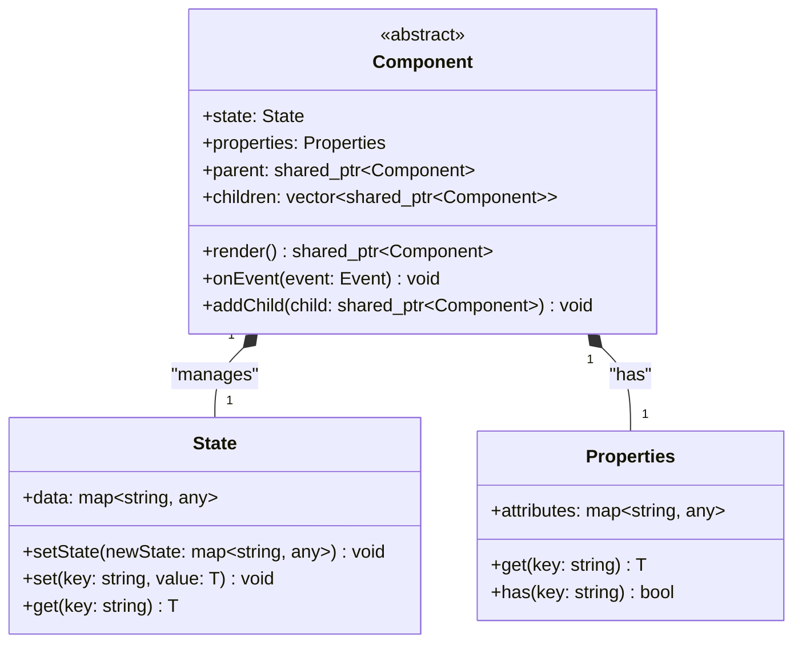
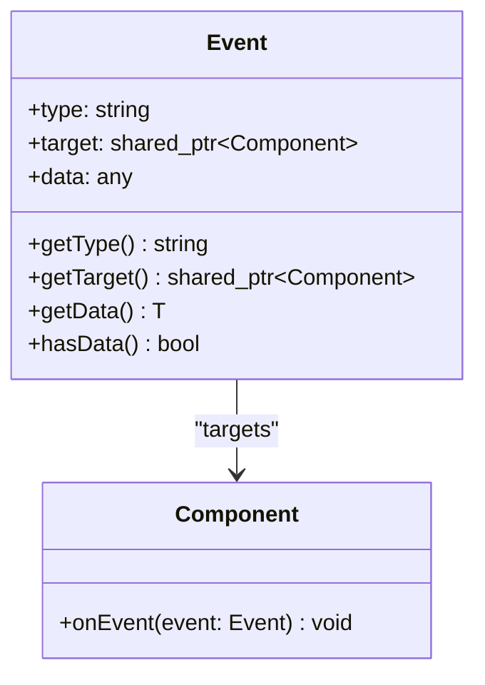
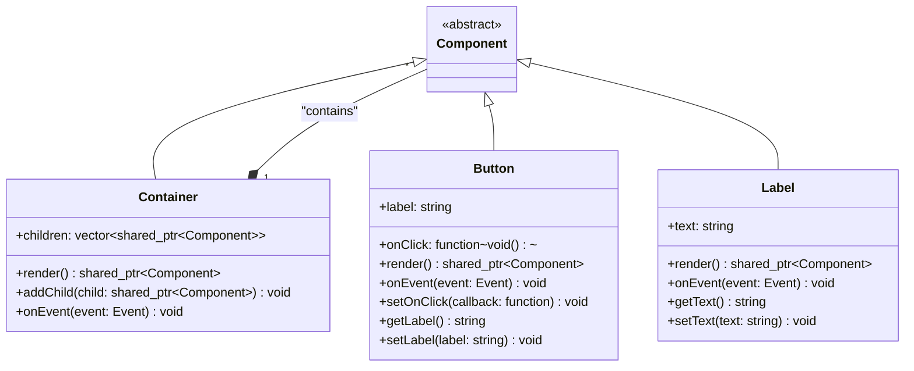
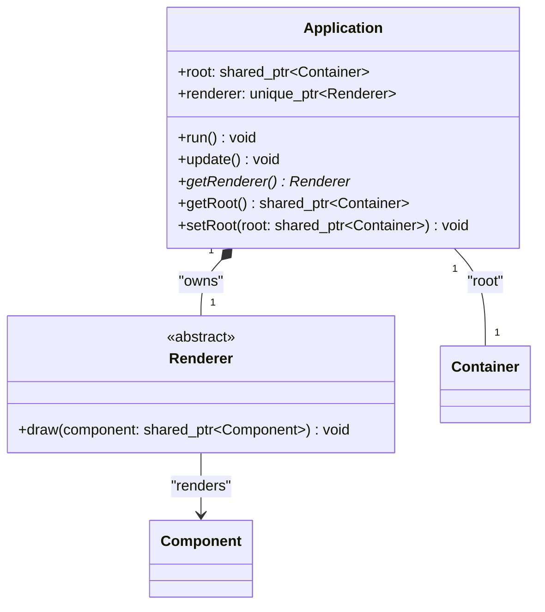

# Architecture

The architecture of our UI component library is designed to be modular, extensible, and easy to understand. Below is a detailed breakdown of the main components and their interactions.

## Core Component System

The foundation of our architecture is built around a hierarchical component system:

**Component** serves as the abstract base class for all UI elements. It manages local state and properties while defining the contract for rendering and event handling. Each component maintains references to its parent and children, enabling a tree-like structure.

**State** holds the dynamic data of a component. When `setState` is called, it triggers a re-render of the component and its children, ensuring the UI stays synchronized with the data.

**Properties** contains immutable attributes passed to the component, typically from its parent. This separation allows for clear data flow and component reusability.

## Event System

The **Event** system handles user interactions and other asynchronous operations. Events bubble up through the component hierarchy, allowing for flexible event handling patterns.

## Concrete Components

**Container** is a specialized component for grouping other components. It manages the hierarchy and handles recursive rendering of its children.

**Button** represents an interactive element with click handling capabilities. It encapsulates both the visual representation and the behavior through callback functions.

**Label** is a simple text display component that typically doesn't handle user interactions but can be styled and positioned within the layout.

## Application and Rendering

**Application** serves as the entry point and manages the global lifecycle. It owns the root container and the renderer, coordinating updates and the rendering pipeline.

**Renderer** is an abstract class responsible for drawing components to the screen. This abstraction allows the library to support different rendering backends (terminal, GUI frameworks, web canvas, etc.) without changing the component logic.

## Architecture Benefits

- **Modularity**: Each component is self-contained with clear responsibilities
- **Extensibility**: New components can be easily added by inheriting from the base Component class
- **Separation of Concerns**: State, properties, and rendering are handled separately
- **Flexible Rendering**: The abstract Renderer allows for multiple output targets
- **Event-Driven**: Reactive updates through the event and state system
